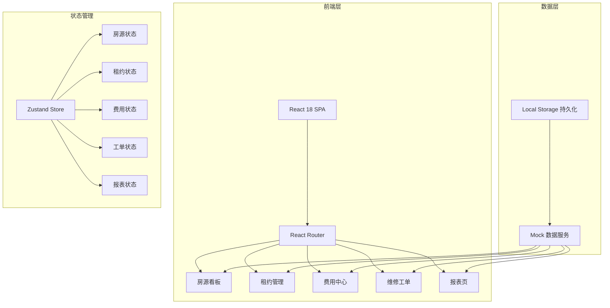
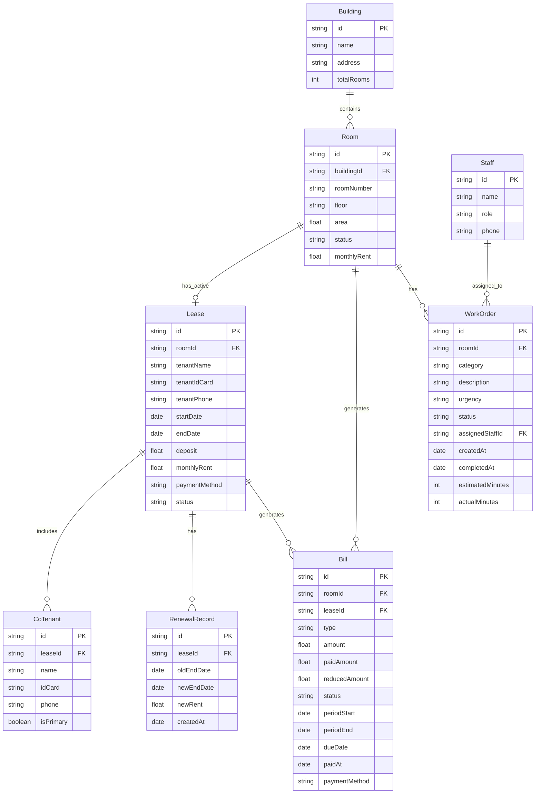

## 1. 架构设计

## 2. 技术说明
- 前端框架：React 18 + TypeScript
- 样式方案：Tailwind CSS 3 + CSS Modules（局部样式覆盖）
- 构建工具：Vite
- 路由：React Router v6
- 状态管理：Zustand
- 图表库：Recharts
- 图标库：Lucide React
- 日期处理：date-fns
- 数据持久化：LocalStorage（Mock 数据，无后端依赖）
- 初始化工具：Vite init

## 3. 路由定义
| 路由 | 用途 |
|------|------|
| / | 重定向至 /dashboard |
| /dashboard | 房源看板主页 |
| /leases | 租约列表页 |
| /leases/new | 新建租约页 |
| /leases/:id | 租约详情页 |
| /finance | 费用中心列表页 |
| /maintenance | 维修工单列表页 |
| /reports | 报表页 |

## 4. 数据模型

### 4.1 数据模型定义

### 4.2 数据定义

**Room.status 枚举值**：`vacant`（空置）、`occupied`（已入住）、`expiring`（即将到期）、`arrears`（欠费）、`configuring`（配置中）

**Lease.status 枚举值**：`active`（生效中）、`expiring`（即将到期）、`expired`（已到期）、`terminated`（已退租）

**Bill.type 枚举值**：`rent`（租金）、`water`（水费）、`electricity`（电费）、`property`（物业费）、`other`（其他）

**Bill.status 枚举值**：`unpaid`（未缴）、`paid`（已缴）、`partial`（部分缴）、`reduced`（已减免）

**WorkOrder.urgency 枚举值**：`low`（低）、`medium`（中）、`high`（高）、`urgent`（紧急）

**WorkOrder.status 枚举值**：`pending`（待分派）、`assigned`（已分派/处理中）、`completed`（已完成）、`reviewed`（已回访）

**Staff.role 枚举值**：`manager`（店长）、`butler`（管家）、`maintenance`（维修师傅）、`finance`（财务）
